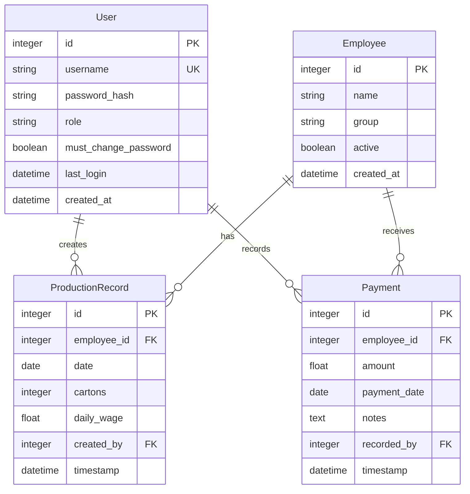
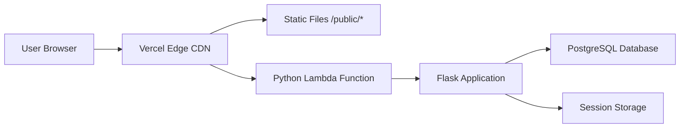
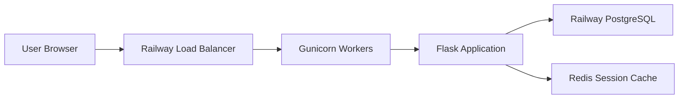
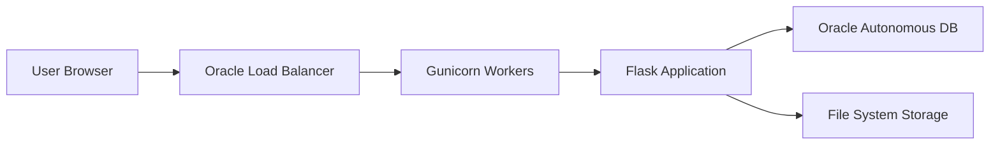
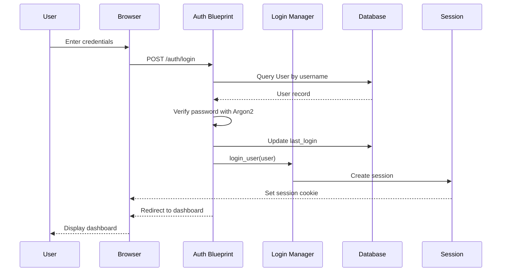

# HILLTOP TEA — System Architecture

## Architecture Overview

Hilltop Tea follows the Model-View-Controller (MVC) architectural pattern, implemented using Flask's Blueprint modular structure. The application is organized into logical components that separate concerns and promote maintainability. Each blueprint handles a specific domain of functionality, with shared utilities and models providing common services.

The application uses SQLAlchemy for database abstraction, supporting both SQLite for development and PostgreSQL for production. Flask-Login handles user authentication and session management, while Flask-WTF provides CSRF protection for form submissions. The wage calculation logic is encapsulated in a dedicated Abstract Data Type (ADT) that implements table-driven rate lookup without conditional business logic.

## Database Schema



## Component Diagram

```mermaid
graph TD
    A[Flask App Factory] --> B[Config Module]
    A --> C[Database Extension]
    A --> D[Login Manager]
    A --> E[CSRF Protection]
    A --> F[Migrate Extension]

    A --> G[Auth Blueprint]
    A --> H[Main Blueprint]
    A --> I[Employees Blueprint]
    A --> J[Production Blueprint]
    A --> K[Payroll Blueprint]
    A --> L[Reports Blueprint]
    A --> M[Users Blueprint]

    G --> N[User Model]
    H --> N
    I --> O[Employee Model]
    J --> O
    J --> P[ProductionRecord Model]
    K --> O
    K --> P
    K --> Q[Payment Model]
    L --> N
    M --> N

    J --> R[Wage Calculator ADT]
    L --> S[ReportLab PDF Generator]

    G --> T[Login Form]
    G --> U[Change Password Form]
    I --> V[Employee Form]
    J --> W[Production Entry Form]
    K --> X[Payment Form]
    M --> Y[User Form]

    H --> Z[Dashboard Templates]
    I --> AA[Employee Templates]
    J --> AB[Production Templates]
    K --> AC[Payroll Templates]
    L --> AD[Report Templates]
    M --> AE[User Templates]
```



## Deployment Architecture

### Vercel Deployment



### Railway Deployment



### Oracle Cloud Deployment



## Security Architecture

### Authentication Flow



### Role Enforcement Chain

```mermaid
graph TD
    A[HTTP Request] --> B{Authenticated?}
    B -->|No| C[Redirect to /auth/login]
    B -->|Yes| D{@login_required passed}
    D --> E{Role Check}
    E -->|Admin| F[Full Access]
    E -->|GM| G[View + Payroll + Reports]
    E -->|Supervisor| H[Production Entry]
    E -->|Invalid| I[HTTP 403 Forbidden]
    F --> J[Execute Route Handler]
    G --> J
    H --> J
    I --> K[Render 403 Template]
```

## Data Flow Narratives

### Production Entry Flow

The production entry process begins when a supervisor or administrator navigates to the production entry page. The system queries the database for all active employees and retrieves any existing production records for the current date. These records are pre-populated in the form, allowing supervisors to update today's entries or add new ones.

As the supervisor enters carton counts for each employee, the Alpine.js wageRow component calculates the daily wage in real-time using the JavaScript implementation of the wage tiers. This provides immediate feedback without server round-trips. When the supervisor submits the form, the server validates all inputs, ensuring carton counts are non-negative integers.

For each employee with a non-zero carton count, the server instantiates a WageCalculator and computes the daily wage using the Python implementation. The system then checks if a production record already exists for this employee and date. If it exists, the record is updated with the new carton count and wage. If not, a new record is inserted. All operations occur within a single database transaction, ensuring atomicity. If any validation fails, the entire transaction is rolled back and error messages are displayed.

### Payroll View Flow

The payroll view process starts when a user requests the payroll page with an optional month parameter. The system defaults to the previous calendar month if no month is specified. The month string is parsed to determine the first and last day of the month, with error handling for invalid formats.

The system executes a single optimized SQL query with LEFT JOINs to aggregate production and payment data by employee. This query calculates total cartons, total wages, and total payments for each employee within the selected month. The results are processed to calculate the outstanding balance for each employee (wages minus payments).

The data is then filtered by employee group if requested, sorted by employee name, and paginated for display. Grand totals are computed across all displayed rows. The template renders the payroll table with appropriate styling for positive (owed) and negative (credit) balances. Users can navigate between months and filter by group using the provided controls.

## Technology Stack

### Backend
- Python 3.11+
- Flask 3.0.3 (Web Framework)
- SQLAlchemy 2.0.30 (ORM)
- Flask-Login 0.6.3 (Authentication)
- Flask-WTF 1.2.1 (Form Handling)
- Flask-Migrate 4.0.7 (Database Migrations)
- Argon2-cffi 23.1.0 (Password Hashing)
- psycopg2-binary 2.9.9 (PostgreSQL Adapter)

### Frontend
- Tailwind CSS (Utility-first CSS)
- Alpine.js 3.14.1 (Reactive Components)
- Chart.js 4.4.1 (Data Visualization)
- Google Fonts (Typography)

### PDF Generation
- ReportLab 4.2.2 (PDF Creation)

### Testing
- pytest 8.2.2 (Test Framework)
- pytest-cov 5.0.0 (Coverage Reporting)

### Deployment
- Gunicorn 22.0.0 (WSGI Server)
- Waitress 3.0.0 (Development Server)
- Vercel (Serverless Platform)
- Railway (Container Platform)
- Oracle Cloud (Cloud Platform)
