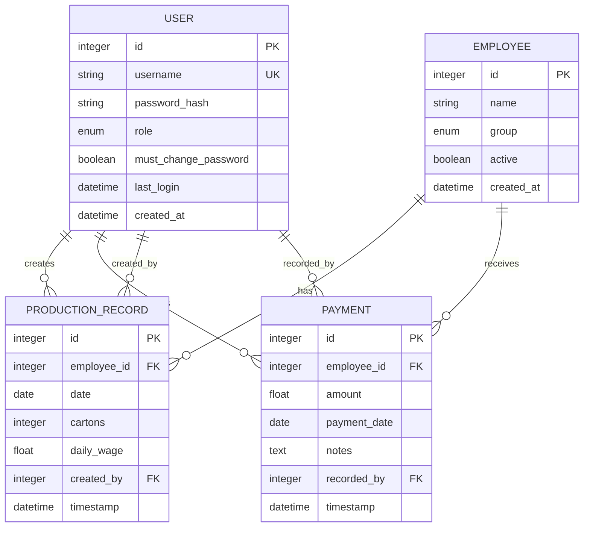
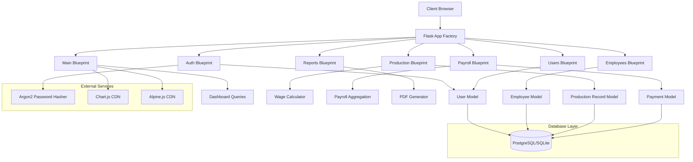
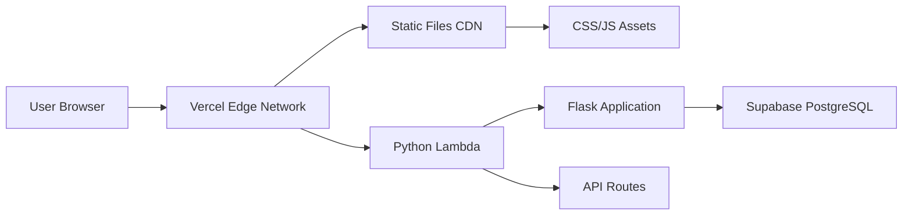
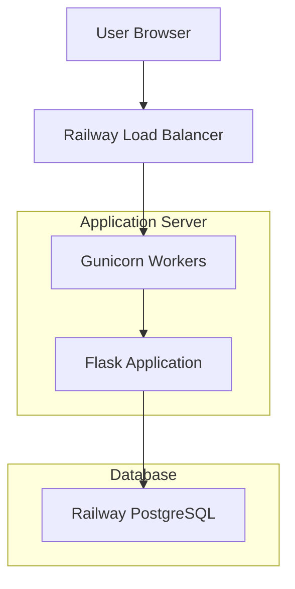
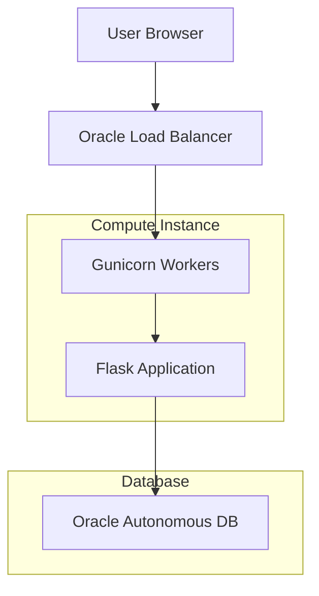
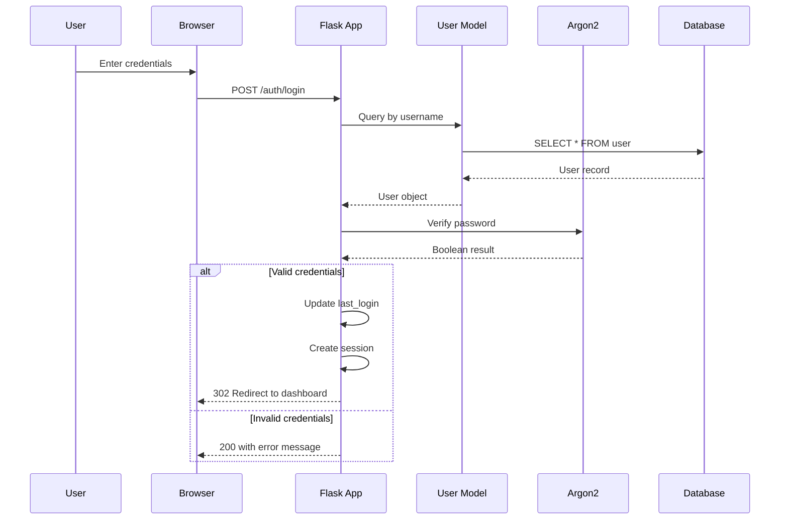

# System Architecture

## Architecture Overview

The Hilltop Tea Wage Tracking & Payroll System follows the Model-View-Controller (MVC) architectural pattern, implemented using Flask's Blueprint modular structure. The application is organized into distinct blueprints for each functional area, promoting separation of concerns and maintainability.

### Core Components

1. **Models Layer** (`app/models.py`): SQLAlchemy ORM models representing database entities
2. **Views Layer** (Blueprints): Route handlers for HTTP requests and responses
3. **Forms Layer** (`app/forms.py`): WTForms for input validation and CSRF protection
4. **Utilities Layer** (`app/utils.py`): Helper functions and decorators
5. **Business Logic** (`app/wage_calculator.py`): Wage calculation ADT

## Entity Relationship Diagram



## Component Diagram



## Deployment Architecture

### Vercel Deployment



### Railway Deployment



### Oracle Cloud Free Tier Deployment



## Security Architecture

### Authentication Flow



### Role Enforcement Chain

```mermaid
graph TD
    A[HTTP Request] --> B{Authenticated?}
    B -->|No| C[Redirect to /auth/login]
    B -->|Yes| D{@login_required decorator}
    D --> E{@require_role decorator}
    E --> F{Role in allowed list?}
    F -->|No| G[Return 403 Forbidden]
    F -->|Yes| H[Execute route handler]
    H --> I[Return response]
```

## Data Flow Narratives

### Daily Production Entry Flow

1. **Request Initiation**: Supervisor navigates to `/production/` route
2. **Data Retrieval**: System queries all active employees and existing records for today
3. **Form Rendering**: Production entry form displays with pre-filled values
4. **User Input**: Supervisor enters carton counts for each employee
5. **Real-time Calculation**: Alpine.js component calculates wages as user types
6. **Form Submission**: POST request sent with carton data
7. **Transaction Start**: Database transaction begins
8. **Validation**: Each carton count validated for non-negative integer
9. **Wage Calculation**: WageCalculator computes daily wage for each employee
10. **Record Upsert**: Existing records updated or new records inserted
11. **Transaction Commit**: Changes committed to database
12. **Response**: User redirected with success message (PRG pattern)

### Payroll View and Payment Recording Flow

1. **Month Selection**: User selects month via query parameter
2. **Date Range Calculation**: System determines first and last day of month
3. **Aggregation Query**: Single SQL query with LEFT JOINs aggregates data
4. **Balance Calculation**: Balance computed as wages minus payments per employee
5. **Grand Totals**: Sum of all columns calculated for summary row
6. **Table Rendering**: Payroll table displayed with formatting
7. **Payment Initiation**: User clicks "Record Payment" button
8. **Modal Display**: Alpine.js modal opens with payment form
9. **Form Submission**: POST request sent with payment details
10. **Record Creation**: Payment record inserted into database
11. **Redirect**: User redirected back to payroll with same month

## Technology Stack Integration

### Database Layer
- **Development**: SQLite with file-based storage
- **Production**: PostgreSQL with connection pooling
- **ORM**: SQLAlchemy 2.0 with declarative models
- **Migrations**: Flask-Migrate for schema versioning

### Security Layer
- **Password Hashing**: Argon2id with configurable parameters
- **Session Management**: Flask-Login with secure cookies
- **CSRF Protection**: Flask-WTF with per-request tokens
- **Input Validation**: WTForms with built-in validators

### Presentation Layer
- **Templating**: Jinja2 with custom context processors
- **Styling**: Tailwind CSS via CDN with custom brand colors
- **Interactivity**: Alpine.js for reactive components
- **Charts**: Chart.js for data visualization
- **PDF Generation**: ReportLab for branded document export

### Deployment Layer
- **Vercel**: Serverless Python runtime with CDN for static assets
- **Railway**: Containerized deployment with managed PostgreSQL
- **Oracle Cloud**: Virtual machine with autonomous database
