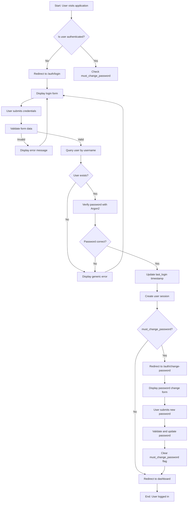
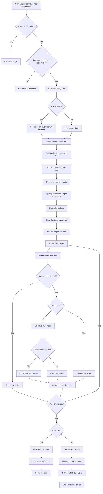
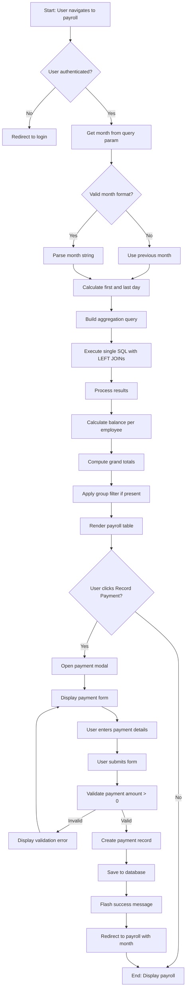
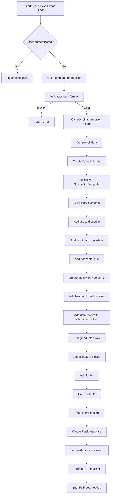
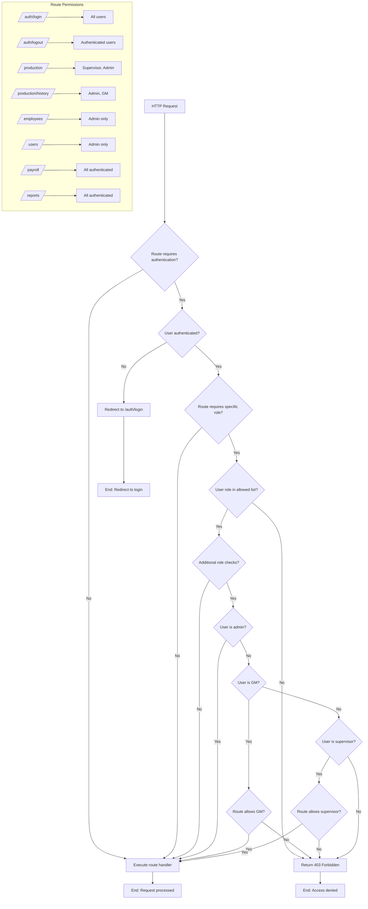

# System Flowcharts

## User Authentication Flow



## Daily Production Entry Flow



## Payroll View and Payment Recording Flow



## PDF Export Flow



## Role-Based Access Control Decision Tree



## Employee Management Flow

```mermaid
flowchart TD
    A[Start: Admin navigates to employees] --> B{User authenticated?}
    B -->|No| C[Redirect to login]
    B -->|Yes| D{User has admin role?}
    D -->|No| E[Return 403 Forbidden]
    D -->|Yes| F[Query active employees]
    F --> G[Render employee list]
    G --> H{Admin action?}
    H -->|Add Employee| I[Display employee form]
    H -->|Edit Employee| J[Load employee data]
    H -->|Deactivate| K[Confirm deactivation]
    H -->|Hard Delete| L[Check for existing records]
    H -->|View Inactive| M[Query inactive employees]
    H -->|Reactivate| N[Confirm reactivation]

    I --> O[User submits form]
    O --> P[Validate name and group]
    P -->|Invalid| Q[Display errors]
    P -->|Valid| R[Create employee record]
    R --> S[Save to database]
    S --> T[Redirect to employee list]

    J --> AA[Pre-fill form with data]
    AA --> AB[User submits form]
    AB --> AC[Validate and update]
    AC --> S

    K --> AD[Set active = False]
    AD --> S

    L --> AE{Has production or payment records?}
    AE -->|Yes| AF[Display error: Cannot delete]
    AE -->|No| AG[Delete employee record]
    AG --> S

    M --> AH[Render inactive list]
    AH --> AI[Display reactivate buttons]

    N --> AJ[Set active = True]
    AJ --> S

    T --> AK[End: Employee updated]
    Q --> AK
    AF --> AK
    AI --> AK
