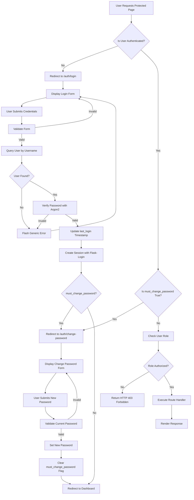
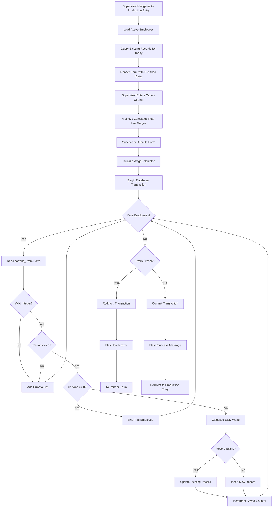
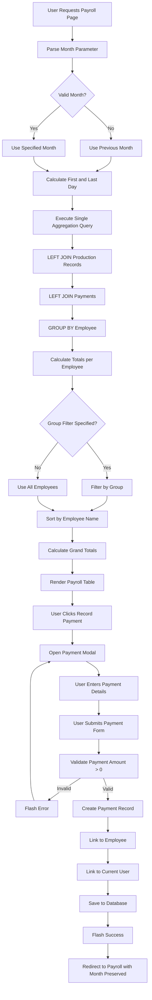
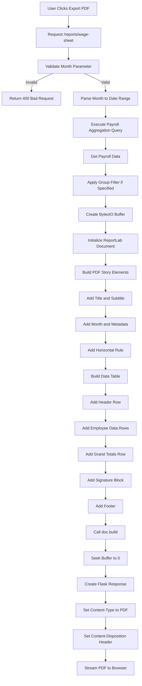

# HILLTOP TEA — System Flowcharts

## User Authentication Flow



## Daily Production Entry Flow



## Payroll View and Payment Recording Flow



## PDF Export Flow



## Role-Based Access Control Decision Tree

```mermaid
flowchart TD
    A[HTTP Request] --> B{Route Protected?}
    B -->|No| C[Execute Handler]
    B -->|Yes| D{@login_required Decorator}
    D --> E{User Authenticated?}
    E -->|No| F[Redirect to /auth/login]
    E -->|Yes| G{@require_role Decorator}
    G --> H{User Role in Allowed Roles?}
    H -->|No| I[Return HTTP 403]
    H -->|Yes| J{Specific Route Check}
    J --> K{/auth/login|/auth/logout|/auth/change-password}
    K -->|Yes| L[All Authenticated Users]
    J --> M{/production/}
    M -->|Yes| N{Role in supervisor, admin?}
    N -->|Yes| O[Execute Handler]
    N -->|No| I
    J --> P{/production/history}
    P -->|Yes| Q{Role in admin, gm?}
    Q -->|Yes| O
    Q -->|No| I
    J --> R{/employees/*}
    R -->|Yes| S{Role == admin?}
    S -->|Yes| O
    S -->|No| I
    J --> T{/users/*}
    T -->|Yes| S
    J --> U{/payroll/*|/reports/*|/}
    U -->|Yes| L
    C --> V[Render Response]
    O --> V
    I --> W[Render 403 Template]
    F --> X[Render Login Template]
